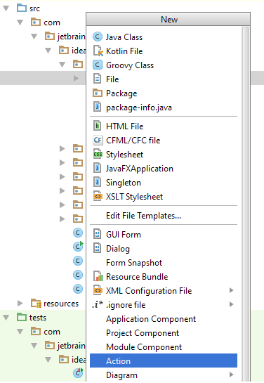
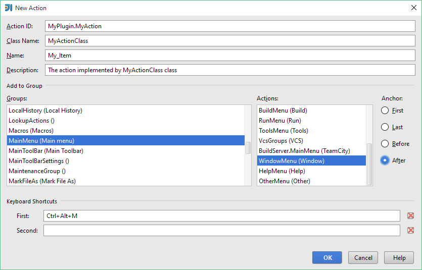

您的插件可以通过向菜单和工具栏添加新项来自定义IntelliJ Platform UI. 
IntelliJ平台提供类[AnAction](upsource:///platform/editor-ui-api/src/com/intellij/openapi/actionSystem/AnAction.java),每次选择时都会调用其`actionPerformed`方法
菜单项或单击工具栏按钮.


要在* IntelliJ Platform *中创建自定义操作,您应该执行两个基本步骤:


1.在插件中,定义将自己的项目添加到菜单和工具栏的操作或操作系统.

2.注册您的行动.


本主题概述了上述步骤.
有关详细信息和示例,请参阅[IntelliJ平台操作系统](/basics/action_system.md).


###定义动作


An action is a class derived from the `AnAction` class. To define your action, in your plugin, create a Java class derived from the `AnAction` class. In this class, override the `actionPerformed` method to be called when a menu item or a toolbar button is selected.
 
 To clarify this procedure, consider the following code snippet that defines the `TextBoxes` class derived from the `AnAction` class:
 
```java
public class TextBoxes extends AnAction {
    // If you register the action from Java code, this constructor is used to set the menu item name
    // (optionally, you can specify the menu description and an icon to display next to the menu item).
    // You can omit this constructor when registering the action in the plugin.xml file.
    public TextBoxes() {
        // Set the menu item name.
        super("Text _Boxes");
        // Set the menu item name, description and icon.
        // super("Text _Boxes","Item description",IconLoader.getIcon("/Mypackage/icon.png"));
    }
 
    public void actionPerformed(AnActionEvent event) {
        Project project = event.getData(PlatformDataKeys.PROJECT);
        String txt= Messages.showInputDialog(project, "What is your name?", "Input your name", Messages.getQuestionIcon());
        Messages.showMessageDialog(project, "Hello, " + txt + "!\n I am glad to see you.", "Information", Messages.getInformationIcon());
    }
}
```

请注意,您可以选择定义从`AnAction`类派生的一组类.
在这种情况下,您的插件将定义一个操作系统.


###注册动作


定义操作或操作系统后,必须注册它们以指定与操作关联的菜单项或工具栏按钮.
您可以通过以下方式之一注册操作:


*在`plugin.xml`文件的`<actions>`部分注册操作.

*从Java代码注册操作.


本节提供了一些说明如何注册操作的示例.
有关更多信息,请参阅[IntelliJ平台操作系统](/basics/action_system.md).


####在plugin.xml文件中注册操作


To register your actions, make appropriate changes to the `<actions>` section of the plugin.xml file for your IDEA project. The following fragment of the plugin.xml file adds the Sample Menu group (item) to the main menu. Clicking this item allows you to access **Sample Menu \| Text Boxes and Sample Menu \| Show Dialog** menu commands:


```xml
<actions>
  <group id="MyPlugin.SampleMenu" text="_Sample Menu" description="Sample menu">
    <add-to-group group-id="MainMenu" anchor="last"  />
       <action id="Myplugin.Textboxes" class="Mypackage.TextBoxes" text="Text _Boxes" description="A test menu item" />
       <action id="Myplugin.Dialogs" class="Mypackage.MyShowDialog" text="Show _Dialog" description="A test menu item" />
  </group>
</actions>
```

plugin.xml文件的这个片段只演示了一些可以在`<actions>`部分中使用的元素来注册你的动作.
有关用于注册操作的所有元素的信息,请参阅[IntelliJ平台操作系统](/basics/action_system.md).


####从Java代码注册操作


或者,您可以从Java代码注册您的操作.
有关如何从Java代码注册操作的更多信息和示例,请参阅[IntelliJ平台操作系统](/basics/action_system.md).


###快速创建动作


IntelliJ平台提供** New Action **向导,该向导建议使用所有必需的基础结构创建操作的简化方法.
该向导可帮助您声明操作类,并自动对plugin.xml文件的`<actions>`部分进行适当的更改.


请注意,您只能使用此向导将新操作添加到主菜单或工具栏上的现有操作组.
如果要创建新的操作组,然后向该组添加操作,请按照本文档前面的说明进行操作.


**使用“新建操作”向导创建和注册操作**


1.在项目中,在目标包的上下文菜单中单击** New **或按** Alt + Insert **.

2.在** New **菜单上,单击** Action **.





3.在打开的** New Action **页面上,填写以下字段,然后单击** OK **:


* **操作ID **:输入操作的唯一ID.
推荐格式:`PluginName.ID`

* **类名**:输入要创建的操作类的名称.

* **名称**:输入与操作相关联的工具栏按钮的菜单项或工具提示的名称.

* **说明**:可选择输入操作说明. 
IDEA状态栏在聚焦动作时指示此描述.

*在**添加到组**区域,在**组**,**操作**和**锚**下,指定要添加新创建的操作的操作组,以及新添加的操作组的位置
相对于其他现有操作创建了操作.

*在**键盘快捷键**区域中,可以选择指定操作的第一次和第二次击键.





IntelliJ平台生成具有指定类名的`.java`文件,在plugin.xml文件中注册新创建的操作,将节点添加到模块树视图,并在编辑器中打开创建的操作类文件.


## 更多信息


有关使用操作的更多信息,请查看[操作系统文档](/basics/action_system.md)

和[动作教程](/tutorials/action_system.md).


