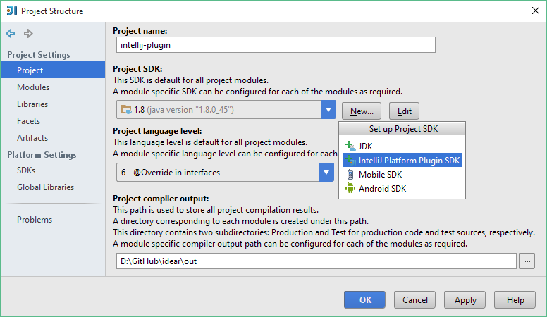
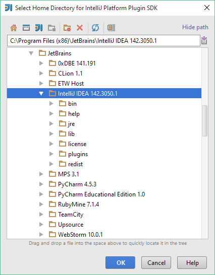
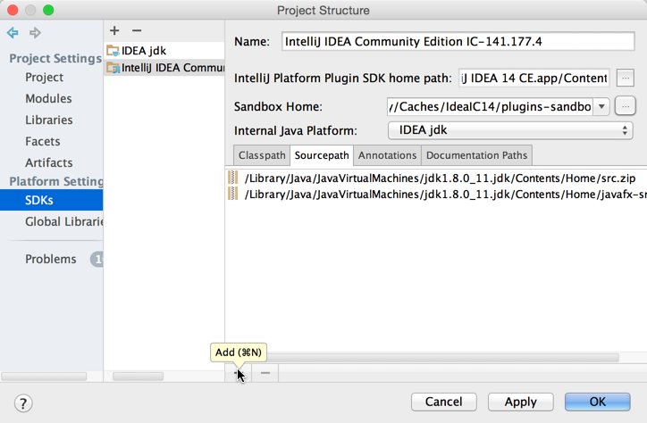

### 预备步骤

使用以下清单确保您已准备好开发自定义插件.

 -  **在本地计算机上获取IntelliJ IDEA CE源代码**.
获取IntelliJ IDEA CE源代码不是插件开发的必要条件,但拥有它可以使调试插件变得更加容易.
有关详细说明,请参阅[检出并构建社区版]的_Getting IntelliJ IDEA社区版源代码_部分(upsource:///README.md).
请注意,插件开发不需要从源代码构建IntelliJ IDEA CE.

 -  **插件DevKit **插件必须[在IntelliJ IDEA中启用](https://www.jetbrains.com/help/idea/managing-plugins.html)

 -  **必须为您的IDEA项目配置IntelliJ Platform SDK **.
有关更多信息,请参阅下文.
  

### 配置IntelliJ Platform SDK
  

要设置插件开发环境:

*  Create a new *IntelliJ Platform SDK* under **File \| Project Structure**:

 

 

*指定* IntelliJ IDEA Community Edition *的安装文件夹作为主目录.

> **警告**您可以使用IntelliJ IDEA Ultimate作为替代方案,但调试核心代码仅适用于* Community Edition *.

 

 

*选择** 1.8 **作为默认Java SDK.
有关创建** 1.8 ** JSDK的说明,请参阅[Check Out And Build Community Edition]的_IntelliJ Build Configuration_部分(upsource:///README.md).

 

 

* 在SDK设置的Sourcepath选项卡中,单击 *Add* 按钮:

 

 

*指定* IntelliJ IDEA Community Edition *的源代码目录:

 

 

*指定** Sandbox Home **目录.
   
* Sandbox Home *目录存储从插件项目的** Run ** configration启动的IDE开发实例的设置.
   
下面显示的是Mac OS X上用户的默认* Sandbox Home *目录.可以选择任何目录作为* Sandbox Home *位置.
   
使用省略号按钮(如下所示)定义自定义位置.
   
   
有关default * Sandbox Home *目录的更多信息,请参见[IDE开发实例](/basics/ide_development_instance.md)页面
   
地点和内容.
  
   

