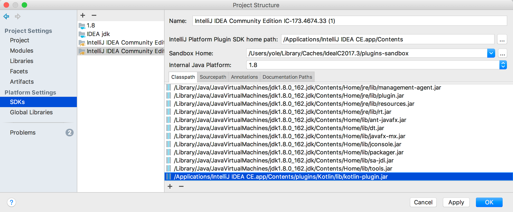

您的插件可能依赖于其他插件的类,无论是捆绑,第三方还是您自己的插件.
为了表达这样的

依赖项(例如Kotlin),您需要执行以下步骤:

* 如果没有捆绑插件,请运行目标IDE的沙箱实例并在那里安装插件.

* 如果您使用Gradle和Kotlin构建脚本来构建插件,请在`intellij`块中使用`setPlugins()`[^ gradleplugin],例如:


```kotlin
intellij {
        setPlugins("org.jetbrains.kotlin:1.3.11-release-IJ2018.3-1")
}
```
* If you're using Gradle with a groovy build script to build your plugin,  add the dependency to the `plugins`[^gradleplugin] parameter of the `intellij` block in your build.gradle, for example:

```groovy
intellij {
    plugins 'org.jetbrains.kotlin:1.3.11-release-IJ2018.3-1'
}
```
* If you aren't using Gradle, add the jars of the plugin you're depending on to the classpath of your *IntelliJ Platform SDK*.
  In order to do that, open the Project Structure dialog, select the SDK you're using, press the + button in the Classpath tab, and
  select the plugin jar file or files.
    * For bundled plugins, the plugin jar files are located in `plugins/<pluginname>` or `plugins/<pluginname>/lib` under the main installation directory.
      If you're not sure which jar to add, you can add all of them.
    * For non-bundled plugins, the plugin jar files are located in `config/plugins/<pluginname>` or `config/plugins/<pluginname>/lib` under the directory specified as "Sandbox Home" in the IntelliJ Platform Plugin SDK settings.




> **警告**不要将插件jar添加为库:这将在运行时失败,因为IntelliJ平台将加载两个独立的依赖插件类副本.


*在plugin.xml中添加一个`<depends>`标签,添加你所依赖的插件的ID作为标签的内容.

例如:


```xml
<depends>org.jetbrains.kotlin</depends>
```

要查找您所依赖的插件的ID,请在其jar中找到`META-INF/plugin.xml`文件并检查`<id>`标记的内容.


## 可选插件依赖项


您还可以指定可选的插件依赖项.
在这种情况下,即使您依赖的插件,您的插件也会加载

未安装或启用,但插件的部分功能将不可用.
为了做到这一点,

将`optional =“true”config-file =“otherconfig.xml”添加到`<depends>`标签中.


例如,如果您正在处理为Java和Kotlin文件添加额外突出显示的插件,则可以使用以下内容建立.
您的主plugin.xml将为Java定义一个注释器,并指定对Kotlin插件的可选依赖项:


```xml
<idea-plugin>
   ...
   <depends optional="true" config-file="withKotlin.xml">org.jetbrains.kotlin</depends>

   <extensions defaultExtensionNs="com.intellij">
      <annotator language="JAVA" implementationClass="com.example.MyJavaAnnotator"/>
   </extensions>
</idea-plugin>
```

然后,在与主plugin.xml文件相同的目录中创建一个名为withKotlin.xml的文件.
在那个文件中,你

为Kotlin定义一个注释器:


```xml
<idea-plugin>
   <extensions defaultExtensionNs="com.intellij">
      <annotator language="kotlin" implementationClass="com.example.MyKotlinAnnotator"/>
   </extensions>
</idea-plugin>
```

---
[^gradleplugin]: See the `plugins` attribute [gradle-intellij-plugin: Configuration](https://github.com/JetBrains/gradle-intellij-plugin#configuration) for acceptable values.


