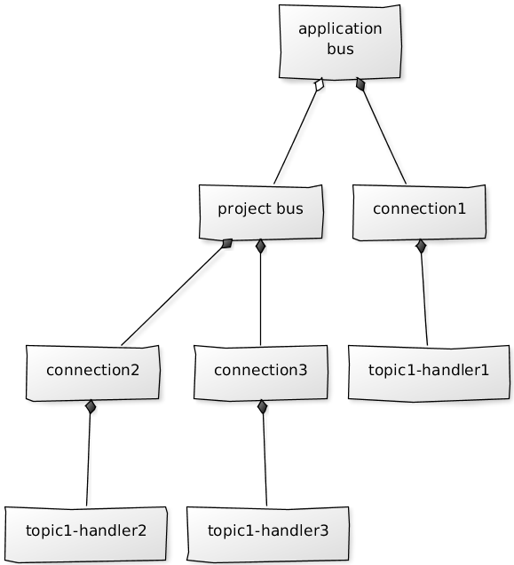
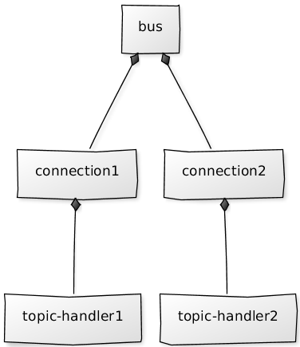

# 目的


本文档的目的是向开发人员和插件编写者介绍IntelliJ平台中可用的消息传递基础结构.
它旨在回答为什么,何时以及如何使用它.


#Rationale


那么,IntelliJ平台中的消息传递是什么？我们为什么需要它？
基本上,它的实施

[观察员模式](https://en.wikipedia.org/wiki/Observer_pattern)

这提供了额外的功能,如层次结构_上的_broadcasting和特殊的_nested events_处理(_neted event_这是从另一个事件的回调中(直接或间接)触发新事件的情况.


# 设计


以下是消息传递API的主要组件.


# #  话题


此类充当消息传递基础结构的端点.
即
允许客户端订阅特定总线内的主题,并将消息发送到特定总线内的特定主题.


* *显示名称*只是用于记录/监控目的的人类可读名称;

* *广播方向*将在广播中详细说明.
默认值为* TO \ _CHILDREN *;

* *监听器类*,它是特定主题的业务接口.

订阅者在消息传递基础结构处注册此接口的实现,并且发布者可以稍后检索符合(IS-A)的对象并调用其中定义的任何方法.
消息传递基础结构负责将该调度发送给该主题的所有订阅者,即,将在注册的回调上调用具有相同参数的相同方法;


##消息总线


是消息传递系统的核心.
用于以下场景:


##连接


管理特定总线内特定客户端的所有订阅.


*保留*主题处理程序*映射的数量(在收到目标主题的消息时调用的回调)

*注意*:允许同一连接中每个主题不超过一个处理程序;


*可以指定* default handler *并订阅目标主题而无需显式提供回调.

存储*(topic-handler)* mapping时,Connection将使用* default handler *;


*可以显式释放获取的资源(* disconnect()*方法).

它也可以插入标准的半自动处理

(

[一次性](upsource:///platform/util/src/com/intellij/openapi/Disposable.java)

);


##完全放弃


*定义业务接口和主题*


```java
public interface ChangeActionNotifier {

    Topic<ChangeActionNotifier> CHANGE_ACTION_TOPIC = Topic.create("custom name", ChangeActionNotifier.class)

    void beforeAction(Context context);
    void afterAction(Context context);
}
```

*订阅*


```java
public void doChange(Context context) {
    ChangeActionNotifier publisher = myBus.syncPublisher(ActionTopics.CHANGE_ACTION_TOPIC);
    publisher.beforeAction(context);
    try {
        // Do action
        // ...
    } finally {
        publisher.afterAction(context)
    }
}
```

*现有资源*


* * MessageBus *实例可通过

[ComponentManager.getMessageBus()](upsource:///platform/core-api/src/com/intellij/openapi/components/ComponentManager.java)<!-- # L85-->

(许多标准接口实现它,例如

[应用](upsource:///platform/core-api/src/com/intellij/openapi/application/Application.java),

[项目](upsource:///platform/core-api/src/com/intellij/openapi/project/Project.java);


* * IntelliJ平台*使用的公共主题数量,例如

[AppTopics](upsource:///platform/platform-api/src/com/intellij/AppTopics.java),

[ProjectTopics](upsource:///platform/projectModel-api/src/com/intellij/ProjectTopics.java)

等等

因此,可以订阅它们以便接收有关处理的信息;


# 广播


消息总线可以组织成层次结构.
此外,* IntelliJ平台*已经拥有它们:


这允许在发送到另一个消息总线的消息上通知在一个消息总线中注册的订户.


*例:*





这里我们有一个简单的层次结构(*应用程序总线*是*项目总线*的父项),同一主题有三个订阅者.


如果* topic1 *将广播方向定义为* TO \ _CHILDREN *,我们得到以下内容:

1.通过* application bus *将消息发送到* topic1 *;

2. * handler1 *被通知有关消息;

3.消息在* project bus *(* handler2 *和* handler3 *)内传递给同一主题的订阅者;


*优点*


我们不需要打扰绑定到子总线但对父总线级事件感兴趣的订户的内存管理.


考虑上面的示例,我们可能希望具有对应用程序级事件做出反应的特定于项目的功能.

我们需要做的就是订阅* project bus *中的目标主题.

项目级订户的硬参考将不会存储在应用程序级别,

即我们只是避免项目重新开放时的内存泄漏.


*选项*


广播配置是按主题定义的.
以下选项可用:


* _TO \ _CHILDREN_(默认);


*  _没有_;


* _TO \ _PARENT_;


# 嵌套消息


_Nested message_是在另一个消息处理期间(直接或间接)发送的消息.

IntelliJ平台的消息传递基础结构可确保发送到特定主题的所有消息都将通过发送订单传递.


*例:*


假设我们有以下配置:





让我们看看如果有人向目标主题发送消息会发生什么:


* _message1_已发送;


* _handler1_接收_message1_并将_message2_发送到同一主题;


* _handler2_收到_message1_;


* _handler2_收到_message2_;


* _handler1_收到_message2_;


#Tips'n'tricks


##救济听众管理


消息传递基础设施非常轻量级,因此,可以在本地子系统中重复使用它以减轻负担

[观察员](https://en.wikipedia.org/wiki/Observer_pattern)建设.
让我们看看有什么必要做的:


1.定义要使用的业务接口;


2.创建使用上面接口的共享消息总线和主题(_shared_这里表示_subject_或_observers_了解它们);


让我们将其与手动实现进行比较:


1.定义监听器接口(业务接口);


2.向所有感兴趣的听众提供_subject_的参考;


3.将监听器存储和监听器管理方法(添加/删除)添加到_subject_;


4.手动迭代所有侦听器并在触发新事件的所有位置调用目标回调;


##避免订阅者共享数据修改


在两个订阅者试图修改同一文档的情况下,我们遇到了问题

([IDEA-71701](https://youtrack.jetbrains.com/issue/IDEA-71701)).


问题是每个文档更改都由以下场景执行:


1._forefore change_ event被发送给所有文档监听器,其中一些在此期间发布新消息;


2.进行实际变更;


3. _将更改后事件发送给所有文档侦听器;


我们接下来是:


1. _message1_被发送到有两个订阅者的主题;

2. _message1_排队等候两个订阅者;

3. _message1_交付开始;

4. _subscriber1_收到_message1_;

5. _subscriber1_在特定范围发出文档修改请求(例如_document.delete(startOffset,endOffset)_);

6._before change_ notification发送给文档监听器;

7.在_before change_ processing期间,_message2_由一个标准文档监听器发送到同一消息总线中的另一个主题;

8.总线在排队_message2_之前尝试传递所有待处理的消息;

9. _subscriber2_接收_message1_并修改文件;

10.调用堆栈未展开且_subscriber1_请求的文档修改操作的_actual change_阶段开始;


**问题**如果_subscriber2_在其之前更改了文档的范围,则_subscriber1_用于初始修改请求的文档范围无效.


