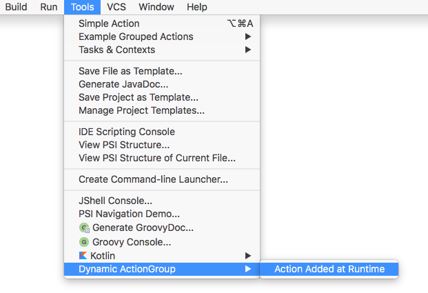

如果某个实现需要多个操作，或者只有太多操作会使菜单超载，则可以将它们组合成组。


### 2.1。
简单的行动小组


在第一个示例中，操作组将作为顶级菜单项提供，操作将表示为下拉菜单项。


#### 2.1.1。
创建简单的操作组


可以通过在`<actions>`部分中添加`<group>`元素来完成分组

[plugin.xml中](https://github.com/JetBrains/intellij-sdk-docs/blob/master/code_samples/register_actions/resources/META-INF/plugin.xml)。

注意这个例子在`<group>`元素中没有`class`属性，因为我们需要IntelliJ Platform框架

为组提供默认实现类。 
2.2节讨论了使用专门的实现。 
`id`属性

必须是唯一的，因此鼓励使用插件ID或包名称。


```xml
<actions>
    <group id="org.jetbrains.tutorials.actions.GroupedActions" text="Example Grouped Actions" popup="true">
    </group>
</actions>
```

#### 2.1.2。
将操作组绑定到UI组件


以下示例显示如何使用`<add-to-group>`元素放置相对于的自定义操作组

**工具**菜单中的条目。
注意，“relative-to-action”属性引用了`SimpleAction`的动作`id`，它不是原生的IntelliJ菜单条目。

相反，`SimpleAction`定义相同

[plugin.xml](https://github.com/JetBrains/intellij-sdk-docs/blob/master/code_samples/register_actions/resources/META-INF/plugin.xml)文件。


```xml
<actions>
     <group id="org.jetbrains.tutorials.actions.GroupedActions" text="Example Grouped Actions" popup="true">
      <add-to-group group-id="ToolsMenu" anchor="after" relative-to-action="org.jetbrains.tutorials.actions.SimpleAction"/>
    </group>
</actions>
```

#### 2.1.3。
为简单操作组创建操作


要创建一个动作，我们需要扩展

[AnAction.java](upsource:///platform/editor-ui-api/src/com/intellij/openapi/actionSystem/AnAction.java)

类。
这个例子使用了`SimplePopDialogAction`类，它弹出一个对话框，在给出用户反馈时

菜单项被选中。
请参阅[注册操作](working_with_custom_actions.md)

有关此课程的更多信息，请参见此页


#### 2.1.4。
向简单操作组添加操作


现在需要在新创建的组中注册`SimplePopDialogAction`。
注意`id`属性设置为

与<group>`元素中的完全限定的`class`属性不同的东西。
一个独特的`id`支持重用

多个菜单或组中的操作类。


```xml
<group id="org.jetbrains.tutorials.actions.GroupedActions" text="Example Grouped Actions" popup="true">
  <add-to-group group-id="ToolsMenu" anchor="after" relative-to-action="org.jetbrains.tutorials.actions.SimpleAction"/>
  <action class="org.jetbrains.tutorials.actions.SimplePopDialogAction" 
    id="org.jetbrains.tutorials.actions.SimpleGroupedAction" text="A Grouped Action" description="Grouped Action Demo">
  </action>
</group>
```

执行上述步骤后，操作组及其内容将在**工具**菜单中提供:


    
  

### 2.2。
实现自定义操作组类


在某些情况下，我们需要根据上下文实现一组操作的某些特定行为。

以下步骤显示了如果满足某些条件，如何使一组操作可用且可见。

在这种情况下，条件是有一个编辑器的实例可用。
这个条件是需要的，因为习惯

操作组将添加到仅允许编辑的IntelliJ菜单中。


#### 2.2.1。
扩展DefaultActionGroup


[DefaultActionGroup.java](upsource:///platform/platform-api/src/com/intellij/openapi/actionSystem/DefaultActionGroup.java)

是一个实现

[DefaultActionGroup.java](upsource:///platform/platform-api/src/com/intellij/openapi/actionSystem/DefaultActionGroup.java)

`DefaultActionGroup`类用于将子动作和分隔符添加到组中。

如果属于该组的一组操作在运行时未更改，则使用此类，这是所有情况中的大多数。

(有关在运行时具有可变子操作的组，请参见第2.3节。)


作为一个例子，我们将扩展

[DefaultActionGroup.java](upsource:///platform/platform-api/src/com/intellij/openapi/actionSystem/DefaultActionGroup.java)

在`register_actions`代码示例中创建`CustomDefaultActionGroup`类:


```java
package org.jetbrains.tutorials.actions;
public class CustomDefaultActionGroup extends DefaultActionGroup {
    @Override
    public void update(AnActionEvent event) {
      // Enable/disable depending on whether user is editing...
    }
}
```

#### 2.2.2。
注册自定义操作组


与简单动作组的情况一样，动作`<group>`应该在*`<actions>`*部分声明。

[plugin.xml中](https://github.com/JetBrains/intellij-sdk-docs/blob/master/code_samples/register_actions/resources/META-INF/plugin.xml)

文件。
注意:
  
*`group>元素中存在`class`属性，它告诉IntelliJ Platform框架
  
使用`CustomDefaultActionGroup`而不是默认实现。
  
*`add-to-group>`元素指定在现有`EditorPopupMenu`的第一个位置添加组。


```xml
<actions>
    <group id="org.jetbrains.tutorials.actions.ExampleCustomDefaultActionGroup" 
        class="org.jetbrains.tutorials.actions.CustomDefaultActionGroup" popup="true"
        text="Example Custom DefaultActionGroup" description="Custom DefaultActionGroup Demo">
      <add-to-group group-id="EditorPopupMenu" anchor="first"/>
    </group>
</actions>
```

#### 2.2.3。
创建一个动作


为简单起见，将重用`SimplePopDialogAction`动作类。


#### 2.2.4。
向组添加操作


As in Section 2.1.4, the `SimplePopDialogAction` action is
added as an `<action>` element in the `<group>` element. Note:
  * The `class` attribute in the `<group>` element has the same fully qualified name as used in Section 2.1.4.
  * The `id` attribute is unique to distinguish it from the use of the `SimplePopDialogAction` class in (Section 2.1.4) `GroupedActions`.
   
```xml
<actions>
    <group id="org.jetbrains.tutorials.actions.ExampleCustomDefaultActionGroup" 
        class="org.jetbrains.tutorials.actions.CustomDefaultActionGroup" popup="true"
        text="Example Custom DefaultActionGroup" description="Custom DefaultActionGroup Demo">
      <add-to-group group-id="EditorPopupMenu" anchor="first"/>
      <action class="org.jetbrains.tutorials.actions.SimplePopDialogAction" id="org.jetbrains.tutorials.actions.CustomGroupedAction"
              text="A Custom Grouped Action" description="Custom Grouped Action Demo"/>
    </group>
</actions>
```

#### 2.2.5。
为组提供特定行为


在这种情况下，我们覆盖`DefaultActionGroup.update(AnActionEvent event)`方法，使组仅可见

如果有可用的编辑器实例。
还设置了自定义图标:


```java
public class CustomDefaultActionGroup extends DefaultActionGroup {
  @Override
  public void update(AnActionEvent event) {
    // Enable/disable depending on whether user is editing
    Editor editor = event.getData(CommonDataKeys.EDITOR);
    event.getPresentation().setEnabled(editor != null);
    // Always make visible.
    event.getPresentation().setVisible(true);
    // Take this opportunity to set an icon for the menu entry.
    event.getPresentation().setIcon(AllIcons.General.Error);
  }
}
```

编译并运行上面的代码示例后，在编辑器中打开文件并右键单击，

将弹出** Editing **菜单，其中包含第一个位置的新动作组。
新组

还会有一个图标:


### 2.3。
具有可变操作集的操作组


如果属于自定义操作组的一组操作将根据上下文而有所不同，则该组必须扩展

[ActionGroup.java](upsource:///platform/editor-ui-api/src/com/intellij/openapi/actionSystem/ActionGroup.java)。

在这种情况下，要分组的动作集是动态定义的。


#### 2.3.1。
创建变量操作组


使用我们扩展的可变数量的操作创建一组操作

`ActionGroup.java`在`register_actions`代码示例中创建`DynamicActionGroup`类:


```java
public class DynamicActionGroup extends ActionGroup {
}
```

#### 2.3.2。
注册可变操作组


要注册动态菜单组，需要在`<actions>`部分中放置一个`<group>`属性

[plugin.xml中](https://github.com/JetBrains/intellij-sdk-docs/blob/master/code_samples/register_actions/resources/META-INF/plugin.xml)。

请注意，启用此组后，它将显示为**工具**菜单中的最后一个条目:


```xml
<actions>
    <group id="org.jetbrains.tutorials.actions.DynamicActionGroup" class="org.jetbrains.tutorials.actions.DynamicActionGroup" popup="true"
           text="Dynamic ActionGroup" description="Dynamic ActionGroup Demo">
      <add-to-group group-id="ToolsMenu" anchor="last"/>
    </group>
</actions>
```
*Note*: If a`<group>` element's `class` attribute names a class derived from `ActionGroup`, then any static `<action>` declarations in the `<group>`
will throw an exception. For a statically defined group of actions use `DefaultActionGroup.java`.

#### 2.3.3。
将子操作添加到组中


向`DynamicActionGroup`添加动作，非空数组

`AnAction`实例应该从`DynamicActionGroup.getChildren(AnActionEvent)`方法返回。
在这里我们再次重用

`SimplePopDialogAction`动作类。


```java
public class DynamicActionGroup extends ActionGroup {
  @NotNull
  @Override
  public AnAction[] getChildren(AnActionEvent anActionEvent) {
    return new AnAction[]{ new SimplePopDialogAction( "Action Added at Runtime",
                                                      "Dynamic Action Demo",
                                                      null)};
  }
}
```

提供`DynamicActionGroup`的实现并使其返回非空的操作数组后，** Tools **菜单中的最后一个位置将包含一组新的操作:





