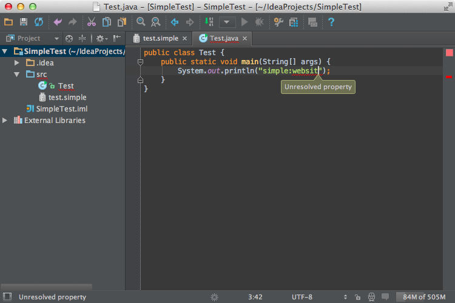

注释器有助于根据特定规则突出显示和注释任何代码。


### 7.1。
定义注释器


在本教程中，我们将在Java代码中注释我们的属性的用法。

让我们考虑一个以*“simple:”*开头的文字作为我们财产的用法。


```java
package com.simpleplugin;

import com.intellij.lang.annotation.*;
import com.intellij.openapi.editor.DefaultLanguageHighlighterColors;
import com.intellij.openapi.project.Project;
import com.intellij.openapi.util.TextRange;
import com.intellij.psi.*;
import com.simpleplugin.psi.SimpleProperty;
import org.jetbrains.annotations.NotNull;

import java.util.List;

public class SimpleAnnotator implements Annotator {
  @Override
  public void annotate(@NotNull final PsiElement element, @NotNull AnnotationHolder holder) {
    if (element instanceof PsiLiteralExpression) {
      PsiLiteralExpression literalExpression = (PsiLiteralExpression) element;
      String value = literalExpression.getValue() instanceof String ? (String) literalExpression.getValue() : null;

      if (value != null && value.startsWith("simple" + ":")) {
        Project project = element.getProject();
        String key = value.substring(7);
        List<SimpleProperty> properties = SimpleUtil.findProperties(project, key);
        if (properties.size() == 1) {
          TextRange range = new TextRange(element.getTextRange().getStartOffset() + 7,
                                          element.getTextRange().getStartOffset() + 7);
          Annotation annotation = holder.createInfoAnnotation(range, null);
          annotation.setTextAttributes(DefaultLanguageHighlighterColors.LINE_COMMENT);
        } else if (properties.size() == 0) {
          TextRange range = new TextRange(element.getTextRange().getStartOffset() + 8,
                                          element.getTextRange().getEndOffset());
          holder.createErrorAnnotation(range, "Unresolved property");
        }
      }
    }
  }
}
```

### 7.2。
注册注释器


```xml
<annotator language="JAVA" implementationClass="com.simpleplugin.SimpleAnnotator"/>
```

### 7.3。
运行该项目


让我们定义以下Java文件并检查IDE是否解析了属性。


```java
public class Test {
    public static void main(String[] args) {
        System.out.println("simple:website");
    }
}
```

![注释器(IMG/annotator.png)


如果我们键入未定义的属性名称，它将使用错误注释代码。





