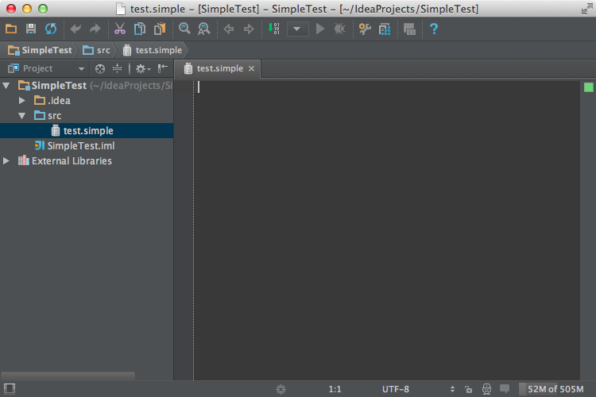

### 2.1。
定义一种语言


注意语言名称的情况 - “简单”。


```java

```

### 2.2。
定义一个图标


复制

[ICON](https://raw.githubusercontent.com/JetBrains/intellij-sdk-docs/master/code_samples/simple_language_plugin/src/com/simpleplugin/icons/jar-gray.png)

到** com.simpleplugin.icons **包。


```java

```

### 2.3。
定义文件类型


```java

```

### 2.4。
定义文件类型工厂


```java

```

### 2.5。
注册文件类型工厂


在plugin.xml中添加:


```xml
<extensions defaultExtensionNs="com.intellij">
      <fileTypeFactory implementation="com.simpleplugin.SimpleFileTypeFactory"/>
</extensions>
```

### 2.6。
运行该项目


创建扩展名为* .simple *的文件

和IntelliJ IDEA会自动将其与我们的语言相关联。





