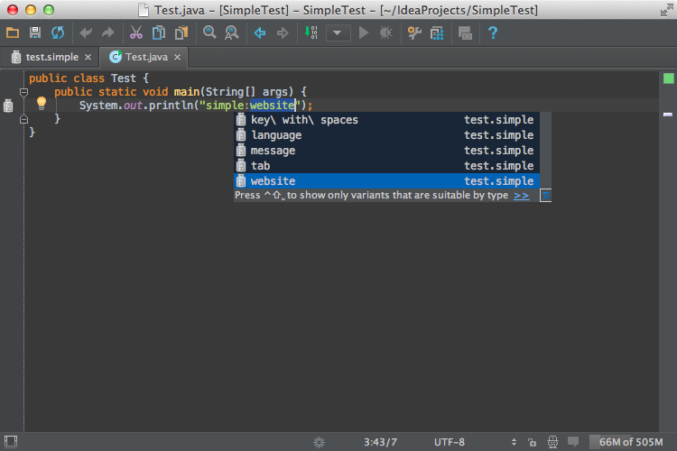
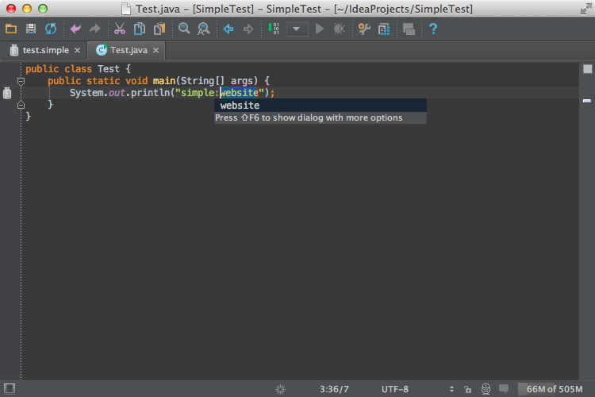

引用是实现自定义语言支持中最重要和最棘手的部分之一。

解析引用意味着能够从元素的使用转变为声明，完成，重命名重构，查找用法等。


**每个可以重命名或引用的元素都需要实现`com.intellij.psi.PsiNamedElement`接口。**


### 10.1。
定义一个名为element的基类


```java

```

```java

```

### 10.2。
为生成的PSI元素定义辅助方法


由于我们需要在PSI类中实现新方法，我们应该在`SimplePsiImplUtil`类中定义它们:


```java
public class SimplePsiImplUtil {

  // ...

  public static String getName(SimpleProperty element) {
      return getKey(element);
  }

  public static PsiElement setName(SimpleProperty element, String newName) {
      ASTNode keyNode = element.getNode().findChildByType(SimpleTypes.KEY);
      if (keyNode != null) {

          SimpleProperty property = SimpleElementFactory.createProperty(element.getProject(), newName);
          ASTNode newKeyNode = property.getFirstChild().getNode();
          element.getNode().replaceChild(keyNode, newKeyNode);
      }
      return element;
  }

  public static PsiElement getNameIdentifier(SimpleProperty element) {
      ASTNode keyNode = element.getNode().findChildByType(SimpleTypes.KEY);
      if (keyNode != null) {
          return keyNode.getPsi();
      } else {
          return null;
      }
  }

  // ...
}
```

请注意，`SimpleElementFactory`类将显示为错误。
我们接下来会创建它。


### 10.3。
定义元素工厂


```java
package com.simpleplugin.psi;

import com.intellij.openapi.project.Project;
import com.intellij.psi.*;
import com.simpleplugin.SimpleFileType;

public class SimpleElementFactory {
  public static SimpleProperty createProperty(Project project, String name) {
    final SimpleFile file = createFile(project, name);
    return (SimpleProperty) file.getFirstChild();
  }

  public static SimpleFile createFile(Project project, String text) {
    String name = "dummy.simple";
    return (SimpleFile) PsiFileFactory.getInstance(project).
        createFileFromText(name, SimpleFileType.INSTANCE, text);
  }
}
```

### 10.4。
更新语法并重新生成解析器


现在我们需要对语法文件进行相应的更改并重新生成解析器和PSI类。


```java
property ::= (KEY? SEPARATOR VALUE?) | KEY {mixin="com.simpleplugin.psi.impl.SimpleNamedElementImpl"
  implements="com.simpleplugin.psi.SimpleNamedElement" methods=[getKey getValue getName setName getNameIdentifier]}
```

不要忘记重新生成解析器!
右键单击`Simple.bnf`文件并选择_Generate Parser Code_。


### 10.5。
定义参考


现在我们需要定义一个引用类来解析它的用法属性。


```java

```

### 10.6。
定义参考贡献者


引用参与者允许您提供从其他语言(如Java)中的元素到您所用语言中的元素的引用。

让我们为每个属性的使用贡献一个参考。


```java

```

### 10.7。
注册参考贡献者


```xml
<psi.referenceContributor implementation="com.simpleplugin.SimpleReferenceContributor"/>
```

### 10.8。
运行该项目


如您所见，IDE现在解析了该属性并提供了完成功能。





*根据定义和用法重命名*重构。


### 10.9。
定义重构支持提供程序


为了允许就地重构，我们应该在重构支持提供程序中明确指定它。


```java

```

### 10.10。
注册重构支持提供程序


```xml
<lang.refactoringSupport language="Simple" implementationClass="com.simpleplugin.SimpleRefactoringSupportProvider"/>
```

### 10.11。
运行该项目





