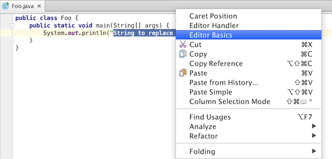

以下一组步骤将说明如何访问文本选择并进行更改.


## 1.1.
前要求


### 1.1.1创建新动作


在此示例中,我们从操作中访问编辑器.

要创建一个动作,我们需要扩展

[AnAction.java](upsource:///platform/editor-ui-api/src/com/intellij/openapi/actionSystem/AnAction.java)

类.


```java
public class EditorIllustration extends AnAction {
}
```

### 1.1.2.
注册一个动作


要注册操作,我们应该将相应的标记添加到插件配置文件的`<actions>`部分

[plugin.xml中](https://github.com/JetBrains/intellij-sdk-docs/blob/master/code_samples/editor_basics/resources/META-INF/plugin.xml)


```xml
<actions>
    <action id="EditorBasics.EditorIllustration" class="EditorIllustration" text="Editor Basics"
        description="Illustrates how to plug an action in">
        <add-to-group group-id="EditorPopupMenu" anchor="last"/>
    </action>
</actions>
```

如果在“EditorPopupMenu”组中注册了一个动作,如上面的示例所示,

当焦点位于编辑器中时,它将在上下文菜单中可用.


### 1.1.3.
定义动作的可见性


要确定操作可见且可用于执行的条件,我们需要覆盖它

`public void update(AnActionEvent e)`方法.


```java
public class EditorIllustration extends AnAction {
    @Override
    public void update(AnActionEvent e) {
    }
}
```

如果我们想要使用文本的选定部分,只有在满足以下要求时才能使操作可用:


*有一个项目开放

*有一个编辑器实例可用

*编辑器中有文本选择


进一步的步骤将显示如何通过获取项目和编辑器的实例以及如何基于它们显示或隐藏操作来检查这些条件.


## 1.2.
获取活动编辑器的实例


可以通过调用`getData(CommonDataKeys.EDITOR)`来获得对Editor实例的引用.

要获得项目引用,我们使用`getProject()`方法.


```java
public class EditorIllustration extends AnAction {
    @Override
    public void update(AnActionEvent e) {
        //Get required data keys
        final Project project = e.getProject();
        final Editor editor = e.getData(CommonDataKeys.EDITOR);
        //Set visibility only in case of existing project and editor
        e.getPresentation().setVisible(project != null && editor != null);
    }
}
```

**注意:**


要访问Editor实例,还可以使用其他方法:


*如果[DataContext](upsource:///platform/editor-ui-api/src/com/intellij/openapi/actionSystem/DataContext.java)
  
对象可用:`final Editor editor = CommonDataKeys.EDITOR.getData(context);`


*如果只有`Project`可用,你可以使用`FileEditorManager.getInstance(project).getSelectedTextEditor()`


## 1.3.
获得插入符号模型和选择


在确保我们打开一个项目和编辑器的实例后,我们需要检查是否有任何选项可用,并根据这些条件设置操作的可见性.

[selectionModel的](upsource:///platform/editor-ui-api/src/com/intellij/openapi/editor/SelectionModel.java)

从编辑器访问允许通过调用它的`hasSelection()`方法来实现.

这是我们的`update(AnActionEvent e)`方法最终应该是这样的:


```java
public class EditorIllustration extends AnAction {
    @Override
    public void update(AnActionEvent e) {
        //Get required data keys
        final Project project = e.getProject();
        final Editor editor = e.getData(CommonDataKeys.EDITOR);
        //Set visibility only in case of existing project and editor and if some text in the editor is selected
        e.getPresentation().setVisible(project != null && editor != null &&
            editor.getSelectionModel().hasSelection());
    }
}
```

**Note:**
Editor allows to access different models of text representation.
Model classes are located in
[editor](upsource:///platform/editor-ui-api/src/com/intellij/openapi/editor)
subpackage of the
[editor-ui-api](upsource:///platform/editor-ui-api)
package and include:

* [CaretModel.java](upsource:///platform/editor-ui-api/src/com/intellij/openapi/editor/CaretModel.java),
* [FoldingModel.java](upsource:///platform/editor-ui-api/src/com/intellij/openapi/editor/FoldingModel.java),
* [IndentsModel.java](upsource:///platform/editor-ui-api/src/com/intellij/openapi/editor/IndentsModel.java),
* [ScrollingModel.java](upsource:///platform/editor-ui-api/src/com/intellij/openapi/editor/ScrollingModel.java),
* [SoftWrapModel.java](upsource:///platform/editor-ui-api/src/com/intellij/openapi/editor/SoftWrapModel.java)


## 1.4.
获取文件


该操作现在可见且可用.

为了使它做某事我们需要覆盖它

`public void actionPerformed(AnActionEvent anActionEvent)`方法.


```java
public class EditorIllustration extends AnAction {
    @Override
    public void update(AnActionEvent e) {
        //code here
    }
    @Override
    public void actionPerformed(AnActionEvent anActionEvent) {
    }
}
```

修改文本的实例

[文献](upsource:///platform/core-api/src/com/intellij/openapi/editor/Document.java)

需要访问. 
[Document](/basics/architectural_overview/documents.md)表示加载到内存中的文本文件的内容,可能在IDEA文本编辑器中打开.

稍后在执行文本替换时将使用文档的实例.

我们还需要弄清楚文本的选定部分的位置.


```java
@Override
public void actionPerformed(final AnActionEvent e) {
    //Get all the required data from data keys
    final Editor editor = e.getRequiredData(CommonDataKeys.EDITOR);
    final Project project = e.getProject();
    //Access document, caret, and selection
    final Document document = editor.getDocument();
    final SelectionModel selectionModel = editor.getSelectionModel();
    final int start = selectionModel.getSelectionStart();
    final int end = selectionModel.getSelectionEnd();
}
```

## 1.5.
修改文字


通常可以通过调用来完成替换

`void replaceString(int startOffset,int endOffset,@ NotNull CharSequence s);;然而,文档的`

必须安全地执行更换操作,这意味着必须锁定文件

任何更改都应在[写入操作]中执行(upsource:///platform/core-api/src/com/intellij/openapi/command/WriteCommandAction.java)<!--#L172-->.

请参阅[线程问题](/basics/architectural_overview/general_threading_rules.md)部分以了解有关IntelliJ平台上的同步问题和更改安全性的更多信息.


```java
@Override
public void actionPerformed(final AnActionEvent e) {
    //Get all the required data from data keys
    final Editor editor = e.getRequiredData(CommonDataKeys.EDITOR);
    final Project project = e.getProject();
    //Access document, caret, and selection
    final Document document = editor.getDocument();
    final SelectionModel selectionModel = editor.getSelectionModel();

    final int start = selectionModel.getSelectionStart();
    final int end = selectionModel.getSelectionEnd();
    //Making the replacement
    WriteCommandAction.runWriteCommandAction(project, () ->
        document.replaceString(start, end, "Replacement")
    );
    selectionModel.removeSelection();
}
```

-----------




-----------

源代码位于

[EditorIllustration.java](https://github.com/JetBrains/intellij-sdk-docs/blob/master/code_samples/editor_basics/src/org/jetbrains/tutorials/editor/basics/EditorIllustration.java).

要查看文本替换的工作原理,请查看

[编辑基础](https://github.com/JetBrains/intellij-sdk-docs/tree/master/code_samples/editor_basics/src/org/jetbrains/tutorials/editor/basics/)

插件,制作项目,运行它,然后调用编辑器上下文菜单中提供的* EditorIllustration *操作.


