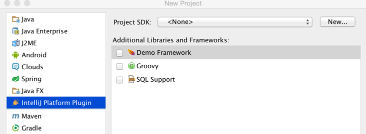

以下教程旨在说明如何为项目支持自定义框架类型，并将此框架类型作为UI组件嵌入项目向导中。


## 1.创建一个新框架


在oder中，为项目提供可配置的自定义框架

[FrameworkTypeEx](upsource:///java/idea-ui/src/com/intellij/framework/FrameworkTypeEx.java)

类需要扩展:


```java
public class DemoFramework extends FrameworkTypeEx {
}
```

## 2.注册框架


通过将* framework.type *属性放入到`<extensions>`部分，将新创建的框架注册为扩展点

[plugin.xml中](https://github.com/JetBrains/intellij-sdk-docs/blob/master/code_samples/framework/resources/META-INF/plugin.xml)

配置文件:


```xml
<extensions defaultExtensionNs="com.intellij">
    <framework.type implementation="com.intellij.tutorials.framework.DemoFramework"/>
</extensions>
```

## 3.设置强制属性


框架组件应具有作为字符串文字传递给构造函数的唯一名称:


```java
public class DemoFramework extends FrameworkTypeEx {
    public static final String FRAMEWORK_ID = "Demo";
    protected DemoFramework() {
        super(FRAMEWORK_ID);
    }
}
```

*可呈现的名称*和*图标*定义与框架相关的可视组件的外观:


```java
public class DemoFramework extends FrameworkTypeEx {
    public static final String FRAMEWORK_ID = "Demo";
    protected DemoFramework() {
        super(FRAMEWORK_ID);
    }

    @NotNull
    @Override
    public String getPresentableName() {
        return "Demo Framework";
    }

    @NotNull
    @Override
    public Icon getIcon() {
        return AllIcons.Providers.Apache;
    }
}
```

## 4.创建用于启用框架支持的提供程序


在执行项目创建步骤时使框架设置可用

`public FrameworkSupportInModuleProvider createProvider();`

的

[DemoFramework](https://github.com/JetBrains/intellij-sdk-docs/blob/master/code_samples/framework/src/com/intellij/tutorials/framework/DemoFramework.java)

必须实施:


```java
@NotNull
@Override
public FrameworkSupportInModuleProvider createProvider() {
    return  new FrameworkSupportInModuleProvider() {
        @NotNull
        @Override
        public FrameworkTypeEx getFrameworkType() {
            return DemoFramework.this;
        }

        @NotNull
        @Override
        public FrameworkSupportInModuleConfigurable createConfigurable(@NotNull FrameworkSupportModel model) {
            return new FrameworkSupportInModuleConfigurable() {
                @Nullable
                @Override
                public JComponent createComponent() {
                    return new JCheckBox("Extra Option");
                }

                @Override
                public void addSupport(@NotNull Module module, @NotNull ModifiableRootModel model, @NotNull ModifiableModelsProvider provider) {
                    //do what you want here: setup a library, generate a specific file, etc
                }
            };
        }

        @Override
        public boolean isEnabledForModuleType(@NotNull ModuleType type) {
            return true;
        }
    };
}
```

编译并运行上面的代码示例后，应在项目向导中提供用于配置新创建的自定义框架的额外选项:




----------

[源代码](https://github.com/JetBrains/intellij-sdk-docs/tree/master/code_samples/framework/src/com/intellij/tutorials/framework)


