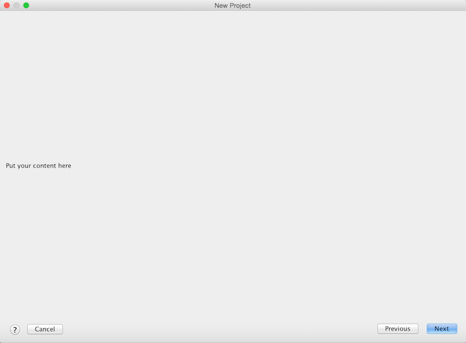

本教程介绍如何向项目向导添加额外步骤以提供其他项目配置设置。


## 预先要求


创建一个空的插件项目。

看到

[创建插件项目](/basics/getting_started/creating_plugin_project.md)

知道怎么做。


## 1.注册模块构建器


项目配置设置取决于项目的模块类型。

在`plugin.xml`配置文件中注册一个新的* moduleBuilder *扩展点。


```xml
  <extensions defaultExtensionNs="com.intellij">
      <moduleBuilder builderClass="org.jetbrains.tutorials.project.wizard.DemoModuleWizardStep" id="DEMO_STEP" order="first"/>
  </extensions>
```

## 2.创建自定义模块构建器


扩展[`ModuleBuilder`](upsource:///platform/lang-api/src/com/intellij/ide/util/projectWizard/ModuleBuilder.java)类以提供自定义配置。


```java
public class DemoModuleWizardStep extends ModuleBuilder {
    public void setupRootModel(ModifiableRootModel modifiableRootModel) throws ConfigurationException {

    }

    public ModuleType getModuleType() {
        return null;
    }
}
```

## 3.定义模块类型


设置要为其提供额外向导步骤的模块类型。
在此示例中，我们选择一个空模块类型。


```java
public class DemoModuleWizardStep extends ModuleBuilder {
    public void setupRootModel(ModifiableRootModel modifiableRootModel) throws ConfigurationException {

    }

    public ModuleType getModuleType() {
        return ModuleType.EMPTY; //or it could be any other module type
    }
}
```

## 4.设计和实现向导步骤


提供要添加到向导的自定义UI组件的实现。

在这种情况下，我们将其留作标签。


```java
public class DemoModuleWizardStep extends ModuleBuilder {
    public void setupRootModel(ModifiableRootModel modifiableRootModel) throws ConfigurationException {

    }

    public ModuleType getModuleType() {
        return ModuleType.EMPTY; 
    }

    @Override
    public ModuleWizardStep[] createWizardSteps(@NotNull WizardContext wizardContext, @NotNull ModulesProvider modulesProvider) {
        return new ModuleWizardStep[]{new ModuleWizardStep() {
            @Override
            public JComponent getComponent() {
                  return new JLabel("Put your content here");
            }

            @Override
            public void updateDataModel() {

            }
        }};
    }
}
```

## 5.检查UI外观


编译并运行插件后，使用* IntelliJ IDEA *的源编译实例创建一个新项目。


选择*空模块*类型，单击下一步，即可进入刚刚添加的额外步骤。
 




根据您的要求修改和调整UI组件。


