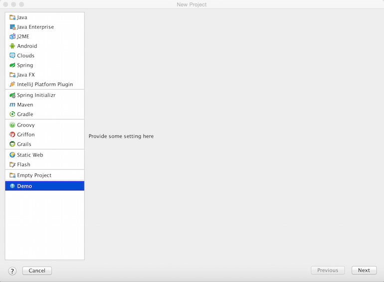

* IntelliJ Platform *提供了一组可以选择的标准模块类型，但是，您可能需要创建一个尚不支持的类型的模块。

本教程介绍如何注册新模块类型并将其链接到项目创建过程和UI。


##预先要求


创建一个空的插件项目，

看到

[创建插件项目](/basics/getting_started/creating_plugin_project.md)。


**注意:用于选择模块类型的UI和通过项目向导创建模块的UI是IntelliJ特定的。**


## 1.注册新模块类型


在中添加新的* moduleType *扩展名

`plugin.xml`

配置文件。


```xml
<extensions defaultExtensionNs="com.intellij">
    <moduleType id="DEMO_MODULE_TYPE" implementationClass="com.intellij.tutorials.module.DemoModuleType"/>
</extensions>
```

## 2.实现ModuleType接口


```java
public class DemoModuleType extends ModuleType<DemoModuleBuilder> {
    private static final String ID = "DEMO_MODULE_TYPE";

    public DemoModuleType() {
        super(ID);
    }

    public static DemoModuleType getInstance() {
        return (DemoModuleType) ModuleTypeManager.getInstance().findByID(ID);
    }

    @NotNull
    @Override
    public DemoModuleBuilder createModuleBuilder() {
        return new DemoModuleBuilder();
    }

    @NotNull
    @Override
    public String getName() {
        return "Demo Module Type";
    }

    @NotNull
    @Override
    public String getDescription() {
        return "Demo Module Type";
    }


    @Override
    public Icon getNodeIcon(@Deprecated boolean b) {
        return AllIcons.General.Information;
    }

    @NotNull
    @Override
    public ModuleWizardStep[] createWizardSteps(@NotNull WizardContext wizardContext, @NotNull DemoModuleBuilder moduleBuilder, @NotNull ModulesProvider modulesProvider) {
        return super.createWizardSteps(wizardContext, moduleBuilder, modulesProvider);
    }
}
```

## 3.实现自定义模块构建器


```java
public class DemoModuleBuilder extends ModuleBuilder {
    @Override
    public void setupRootModel(ModifiableRootModel model) throws ConfigurationException {

    }

    @Override
    public ModuleType getModuleType() {
        return DemoModuleType.getInstance();
    }

    @Nullable
    @Override
    public ModuleWizardStep getCustomOptionsStep(WizardContext context, Disposable parentDisposable) {
        return new DemoModuleWizardStep();
    }
}
```

## 4.提供自定义向导步骤


为项目创建阶段提供UI组件的实现。


```java
public class DemoModuleWizardStep extends ModuleWizardStep {
    @Override
    public JComponent getComponent() {
        return new JLabel("Provide some setting here");
    }

    @Override
    public void updateDataModel() {
        //todo update model according to UI
    }
}
```

## 5.创建新类型的模块


编译并运行插件后，使用* IntelliJ IDEA *的源编译实例创建一个新项目。

您将在“项目向导”中看到新的模块类型及其设置面板。





