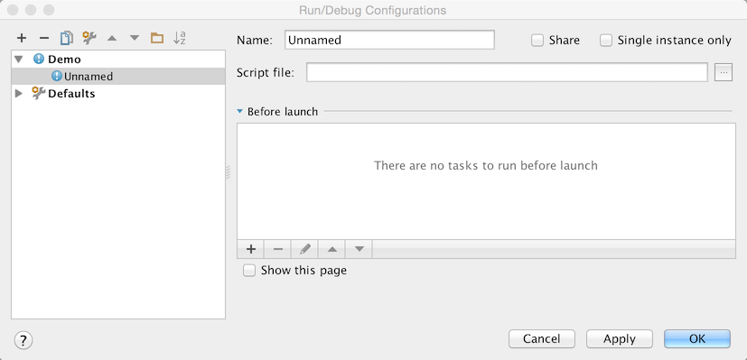

这一系列步骤显示了如何注册和实现简单的运行配置。

运行配置用于从基于 *IntelliJ Platform* 的产品中运行内部和外部流程。

要熟悉运行配置的概念，请参阅

[运行/调试配置](https://www.jetbrains.com/idea/help/run-debug-configuration.html)

部分

[IntelliJ IDEA Web帮助](https://www.jetbrains.com/idea/help/intellij-idea.html)


## 预先要求


创建一个空的插件项目。

看到

[创建插件项目](/basics/getting_started/creating_plugin_project.md)。


## 1.注册一个新的ConfigurationType


添加新的* configurationType *扩展名

[plugin.xml中](https://github.com/JetBrains/intellij-sdk-docs/blob/master/code_samples/run_configuration/resources/META-INF/plugin.xml)


```xml
<extensions defaultExtensionNs="com.intellij">
  <configurationType implementation="org.jetbrains.tutorials.run.configuration.DemoRunConfigurationType"/>
</extensions>
```

## 2.实现ConfigurationType


实行

[ConfigurationType](upsource:///platform/lang-api/src/com/intellij/execution/configurations/ConfigurationType.java)

在步骤1中注册的界面。


```java
public class DemoRunConfigurationType implements ConfigurationType {
    @Override
    public String getDisplayName() {
        return "Demo";
    }

    @Override
    public String getConfigurationTypeDescription() {
        return "Demo Run Configuration Type";
    }

    @Override
    public Icon getIcon() {
        return AllIcons.General.Information;
    }

    @NotNull
    @Override
    public String getId() {
        return "DEMO_RUN_CONFIGURATION";
    }

    @Override
    public ConfigurationFactory[] getConfigurationFactories() {
        return new ConfigurationFactory[]{new DemoConfigurationFactory(this)};
    }
}
```

## 3.实现ConfigurationFactory


实施新的

[ConfigurationFactory](upsource:///platform/lang-api/src/com/intellij/execution/configurations/ConfigurationFactory.java)

通过它创建自定义运行配置。


```java
public class DemoConfigurationFactory extends ConfigurationFactory {
    private static final String FACTORY_NAME = "Demo configuration factory";

    protected DemoConfigurationFactory(ConfigurationType type) {
        super(type);
    }

    @Override
    public RunConfiguration createTemplateConfiguration(Project project) {
        return new DemoRunConfiguration(project, this, "Demo");
    }

    @Override
    public String getName() {
        return FACTORY_NAME;
    }
}

```

## 4.实现运行配置


要通过UI显示更改，请实施新的运行配置。


**注意:**在大多数情况下，您可以从中派生自定义运行配置类

[RunConfigurationBase](upsource:///platform/lang-api/src/com/intellij/execution/configurations/RunConfigurationBase.java)。

如果需要实现特定设置外化规则和I/O行为，

使用

[RunConfiguration](upsource:///platform/lang-api/src/com/intellij/execution/configurations/RunConfiguration.java)

接口。


```java
public class DemoRunConfiguration extends RunConfigurationBase {
    protected DemoRunConfiguration(Project project, ConfigurationFactory factory, String name) {
        super(project, factory, name);
    }

    @NotNull
    @Override
    public SettingsEditor<? extends RunConfiguration> getConfigurationEditor() {
        return new DemoSettingsEditor();
    }

    @Override
    public void checkConfiguration() throws RuntimeConfigurationException {

    }

    @Nullable
    @Override
    public RunProfileState getState(@NotNull Executor executor, @NotNull ExecutionEnvironment executionEnvironment) throws ExecutionException {
        return null;
    }
}
```

## 5.创建并实现运行配置UI表单


创建一个新的

[UI形式]

它定义了新的运行配置的内部部分应该是什么样子。

默认运行配置将如下所示:





## 6.绑定UI表单


UI表单应该与负责处理UI组件逻辑的Java类绑定。


```java
public class DemoSettingsEditor extends SettingsEditor<DemoRunConfiguration> {
    private JPanel myPanel;
    private LabeledComponent<ComponentWithBrowseButton> myMainClass;

    @Override
    protected void resetEditorFrom(DemoRunConfiguration demoRunConfiguration) {

    }

    @Override
    protected void applyEditorTo(DemoRunConfiguration demoRunConfiguration) throws ConfigurationException {

    }

    @NotNull
    @Override
    protected JComponent createEditor() {
        return myPanel;
    }

    private void createUIComponents() {
        myMainClass = new LabeledComponent<ComponentWithBrowseButton>();
        myMainClass.setComponent(new TextFieldWithBrowseButton());
    }
}
```

## 7.编译并运行插件


参考

[运行和调试插件](/basics/getting_started/running_and_debugging_a_plugin.md)。


完成上述步骤后，您可以创建自定义运行配置

从你的插件。


