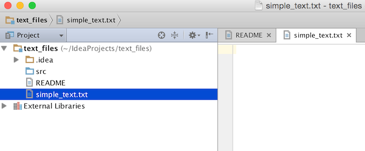

本教程旨在说明如何以编程方式修改项目树结构视图外观。

如果您需要了解有关基于IntelliJ的IDE中项目视图的基本概念的更多信息，请参阅

[探索项目结构](https://www.jetbrains.com/idea/help/exploring-the-project-structure.html#d164891e120)

的

[IntelliJ IDEA Web帮助](https://www.jetbrains.com/idea/help/intellij-idea.html)。


下面的系列步骤显示了如何在项目视图面板中过滤掉并保持仅可见的文本文件和目录。


##预先要求


创建一个空的插件项目。

看到

[创建插件项目](/basics/getting_started/creating_plugin_project.md)。


## 1.注册自定义TreeStructure Provider


添加新的* treeStructureProvider *扩展名

[plugin.xml中](https://github.com/JetBrains/intellij-sdk-docs/blob/master/code_samples/tree_structure_provider/resources/META-INF/plugin.xml)


```java
<extensions defaultExtensionNs="com.intellij">
  <treeStructureProvider implementation="org.jetbrains.tutorials.tree.structure.TextOnlyTreeStructureProvider"/>
</extensions>
```

## 2.实现自定义TreeStructureProvider


要提供自定义结构视图行为，您需要实现TreeStructureProvider接口。


```java
public class TextOnlyTreeStructureProvider implements TreeStructureProvider {
    @NotNull
    @Override
    public Collection<AbstractTreeNode> modify(@NotNull AbstractTreeNode parent, @NotNull Collection<AbstractTreeNode> children, ViewSettings settings) {
        return null;
    }

    @Nullable
    @Override
    public Object getData(Collection<AbstractTreeNode> collection, String s) {
        return null;
    }
}
```

## 3.覆盖modify()方法


要实现树结构节点过滤逻辑，请覆盖`modify()`方法。

下面的示例显示了如何筛选出除了与文本文件和目录对应的节点外的所有项目视图节点。


```java

```

## 4.编译并运行插件


编译并运行本教程中的代码示例。

参考

[运行和调试插件](/basics/getting_started/running_and_debugging_a_plugin.md)。


完成上述步骤后，您只能在项目视图中看到属于项目的文本文件和目录。





查看

[插件源代码](https://github.com/JetBrains/intellij-sdk-docs/tree/master/code_samples/tree_structure_provider)

并构建项目以了解TreeStructureView提供程序如何在实践中工作。


