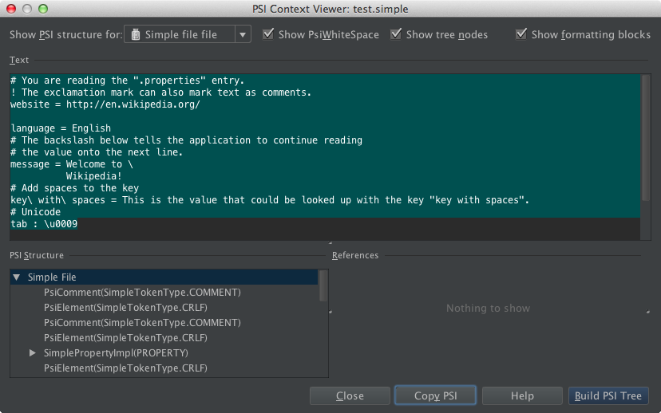

第一个测试将检查解析器是否实现了

[Lexer和Parser定义](/tutorials/custom_language_support/lexer_and_parser_definition.md)

部分

[自定义语言支持教程](/tutorials/custom_language_support_tutorial.md)

像我们期望的那样工作。


### 2.1。
定义输入测试数据


在* testData *文件夹中创建文件* ParsingTestData.simple *。


```bash
# You are reading the ".properties" entry.
! The exclamation mark can also mark text as comments.
website = http://en.wikipedia.org/

language = English
# The backslash below tells the application to continue reading
# the value onto the next line.
message = Welcome to \
          Wikipedia!
# Add spaces to the key
key\ with\ spaces = This is the value that could be looked up with the key "key with spaces".
# Unicode
tab : \u0009
```

### 2.2。
复制预期的PSI树


获得任何文件的预期PSI结构的最简单方法是使用PSI Viewer。

运行项目并调用`Tools`＆rarr; 
`查看PSI结构`。





使用“复制PSI”按钮将预期的PSI结构复制到剪贴板。


### 2.3。
定义输出测试数据


使用复制的PSI树创建文件* ParsingTestData.txt *。


```java
Simple File(0,433)
  PsiComment(SimpleTokenType.COMMENT)('# You are reading the ".properties" entry.')(0,42)
  PsiElement(SimpleTokenType.CRLF)('\n')(42,43)
  PsiComment(SimpleTokenType.COMMENT)('! The exclamation mark can also mark text as comments.')(43,97)
  PsiElement(SimpleTokenType.CRLF)('\n')(97,98)
  SimplePropertyImpl(PROPERTY)(98,132)
    PsiElement(SimpleTokenType.KEY)('website')(98,105)
    PsiWhiteSpace(' ')(105,106)
    PsiElement(SimpleTokenType.SEPARATOR)('=')(106,107)
    PsiWhiteSpace(' ')(107,108)
    PsiElement(SimpleTokenType.VALUE)('http://en.wikipedia.org/')(108,132)
  PsiElement(SimpleTokenType.CRLF)('\n')(132,133)
  PsiElement(SimpleTokenType.CRLF)('\n')(133,134)
  SimplePropertyImpl(PROPERTY)(134,152)
    PsiElement(SimpleTokenType.KEY)('language')(134,142)
    PsiWhiteSpace(' ')(142,143)
    PsiElement(SimpleTokenType.SEPARATOR)('=')(143,144)
    PsiWhiteSpace(' ')(144,145)
    PsiElement(SimpleTokenType.VALUE)('English')(145,152)
  PsiElement(SimpleTokenType.CRLF)('\n')(152,153)
  PsiComment(SimpleTokenType.COMMENT)('# The backslash below tells the application to continue reading')(153,216)
  PsiElement(SimpleTokenType.CRLF)('\n')(216,217)
  PsiComment(SimpleTokenType.COMMENT)('# the value onto the next line.')(217,248)
  PsiElement(SimpleTokenType.CRLF)('\n')(248,249)
  SimplePropertyImpl(PROPERTY)(249,292)
    PsiElement(SimpleTokenType.KEY)('message')(249,256)
    PsiWhiteSpace(' ')(256,257)
    PsiElement(SimpleTokenType.SEPARATOR)('=')(257,258)
    PsiWhiteSpace(' ')(258,259)
    PsiElement(SimpleTokenType.VALUE)('Welcome to \\n          Wikipedia!')(259,292)
  PsiElement(SimpleTokenType.CRLF)('\n')(292,293)
  PsiComment(SimpleTokenType.COMMENT)('# Add spaces to the key')(293,316)
  PsiElement(SimpleTokenType.CRLF)('\n')(316,317)
  SimplePropertyImpl(PROPERTY)(317,410)
    PsiElement(SimpleTokenType.KEY)('key\ with\ spaces')(317,334)
    PsiWhiteSpace(' ')(334,335)
    PsiElement(SimpleTokenType.SEPARATOR)('=')(335,336)
    PsiWhiteSpace(' ')(336,337)
    PsiElement(SimpleTokenType.VALUE)('This is the value that could be looked up with the key "key with spaces".')(337,410)
  PsiElement(SimpleTokenType.CRLF)('\n')(410,411)
  PsiComment(SimpleTokenType.COMMENT)('# Unicode')(411,420)
  PsiElement(SimpleTokenType.CRLF)('\n')(420,421)
  SimplePropertyImpl(PROPERTY)(421,433)
    PsiElement(SimpleTokenType.KEY)('tab')(421,424)
    PsiWhiteSpace(' ')(424,425)
    PsiElement(SimpleTokenType.SEPARATOR)(':')(425,426)
    PsiWhiteSpace(' ')(426,427)
    PsiElement(SimpleTokenType.VALUE)('\u0009')(427,433)
```

### 2.4。
定义解析测试


```java

```

### 2.5。
运行测试


运行测试并确保它是绿色的。


